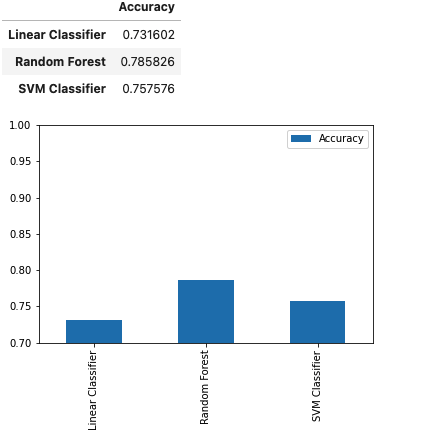
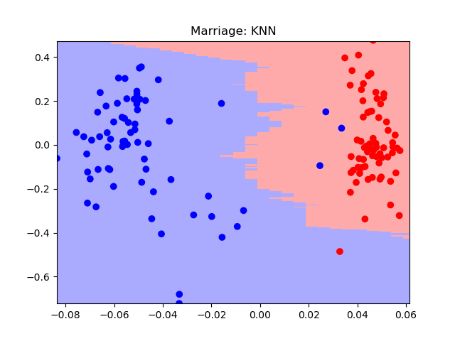

<!--
*** Thanks for checking out the Best-README-Template. If you have a suggestion
*** that would make this better, please fork the repo and create a pull request
*** or simply open an issue with the tag "enhancement".
*** Thanks again! Now go create something AMAZING! :D
-->

<!-- PROJECT SHIELDS -->
<!--
*** I'm using markdown "reference style" links for readability.
*** Reference links are enclosed in brackets [ ] instead of parentheses ( ).
*** See the bottom of this document for the declaration of the reference variables
*** for contributors-url, forks-url, etc. This is an optional, concise syntax you may use.
*** https://www.markdownguide.org/basic-syntax/#reference-style-links
-->

[![MIT License][license-shield]][license-url]
[![LinkedIn][linkedin-shield]][linkedin-url]

<!-- PROJECT LOGO -->
 

  <h3 align="center">Model Exploration</h3>

  

    Test various aspects of model performance on multiple dataset
  

<!-- TABLE OF CONTENTS -->

  
Table of Contents

  <ol>
    <li>
      <a href="#about-the-project">About The Projects</a>
      <ul>
        <li><a href="#built-with">Built With</a></li>
      </ul>
    </li>
        <li>
      <a href="#about-the-project">The Projects</a>
      <ul>
        <li><a href="#built-with">Random Forest Classifier (Object Oriented)</a></li>
        <li><a href="#built-with">Mutliple Classifiers (Object Oriented)</a></li>
        <li><a href="#built-with">Comparing Classifiers</a></li>
        <li><a href="#built-with">randomforest_v_svm_classifier</a></li>
        <li><a href="#built-with">speed_v_accuracy_multiple_models</a></li>
      </ul>
    </li>
    <li><a href="#license">License</a></li>
    <li><a href="#contact">Contact</a></li>
  </ol>

<!-- ABOUT THE PROJECT -->
## About The Projects

One of the best ways to learn about modeling, is to just mess around with all models. In this repo, I have mutliple datasources and scripts written to evaluate different model performances. 

The goal of this repo is to employ different models, hyper-tuning techniques, and software structure. You can see each project is based off of comapring models, to one extent or another, but it goes another level deeper by having each project strucutred differently (procedural vs object oriented etc) as a way for me to practice and show just how much analytics is an art. 

I have created both juypter notebooks and python scripts of the code. I personally like pure python code, but for tutorials such as this, jupyter notebooks are a great resource for sharing. The HTML and PDF of the completed notebook is also provided for your own edification/if you don't want to run the code yourself. 

All data used is for the projects can be found in the *data* folder. 

**Enjoy!**

### Built With

This section should list any major frameworks that you built your project using. Leave any add-ons/plugins for the acknowledgements section. Here are a few examples.
* [Python](https://www.python.org/)
* [jupyter](https://jupyter.org/)

<!-- The Projects-->
## The Projects

### Random Forest Classifier (Object Oriented)

The data for this analysis is of the Pima Indians and their liklihood of diabetetes. The data can be found [here](https://data.world/uci/pima-indians-diabetes) or in the data folder in this repo. 

This script implements a random forest classifier where the classifier will be evaluated via the out-of-bag (OOB) error estimate, using the above dataset.

Each tree in the forest is constructed using a different bootstrap sample from the original data.

The objective of this script is to explore an object oriented approach to models. This is a binary classification on the dataset to determine if a person has diabetes. 

Click [here](https://github.com/annakoretchko/model-exploration/blob/master/OOP_forest/OOP_forest.ipynb) to follow the notebook tutorial!

### Mutliple Classifiers (Object Oriented)

 

Using the same dataset as for the Random Forest Classifier, this script will walk you through testing different classifiers, hyertuning methods, and speed on diabetes classification cataset.

It has the following strucutre and is also object oriented:

1. Linear Regression Classifer
    * Classification
2. Random Forest Classifier
    * Classification
    * Feature Importance
    * Hyper-Parameter Tuning
3. Support Vector Machine
    * Preprocesing
    * Classification
    * Hyper-Parameter Tuning
    * Cross-Validation Results
4. Principal Component Analysis
    * Dimensionality reduction is an essential task in many data analysis exercises, and it involves projecting the data to a lower-dimensional space using Singular Value Decomposition.

Click [here](https://github.com/annakoretchko/model-exploration/blob/master/MutlipleClassifiers(ObjectOriented)/MutlipleClassifiers(ObjectOriented).ipynb) to follow the notebook tutorial!

### Comparing Classifiers

 

**Comparing Bayes, Logistic, and KNN classifiers**

There are a myriad of classifiers out there, each with their own use case and rationale for when to be employed. This script goes through the results of Naive Bayes, Logisitc, and KNN all on the same sample dataset so that their results can be directly compared to one another.

Then, I performed PCA to project the data into two-dimensional space so that I can plot the data points and decision boundary of each classifier and visually compare the results.

I hope you enjoy this exploration into each models efficacy!

Click [here](https://github.com/annakoretchko/model-exploration/blob/master/comparing_classifiers/comparing_classifiers.ipynb) to follow 

<!-- USAGE EXAMPLES -->
## Usage

This packages allows Garmin Connect users to analyize their data in a pythonic manner, which can be extrapolated further into a myriad of projects! 
_To see a live demo of the graphs/outputs, please refer to the [Demo](https://anna-koretchko.ue.r.appspot.com/garmin)_

<!-- LICENSE -->
## License

Distributed under the MIT License. See `LICENSE` for more information.

<!-- CONTACT -->
## Contact

* Anna Koretchko - [Personal Website](https://anna-koretchko.ue.r.appspot.com/index)
* Email - annakoretchko@gmail.com

<!-- MARKDOWN LINKS & IMAGES -->
<!-- https://www.markdownguide.org/basic-syntax/#reference-style-links -->
[contributors-shield]: https://img.shields.io/github/contributors/othneildrew/Best-README-Template.svg?style=for-the-badge
[contributors-url]: https://github.com/othneildrew/Best-README-Template/graphs/contributors
[forks-shield]: https://img.shields.io/github/forks/othneildrew/Best-README-Template.svg?style=for-the-badge
[forks-url]: https://github.com/othneildrew/Best-README-Template/network/members
[stars-shield]: https://img.shields.io/github/stars/othneildrew/Best-README-Template.svg?style=for-the-badge
[stars-url]: https://github.com/othneildrew/Best-README-Template/stargazers
[issues-shield]: https://img.shields.io/github/issues/othneildrew/Best-README-Template.svg?style=for-the-badge
[issues-url]: https://github.com/othneildrew/Best-README-Template/issues
[license-shield]: https://img.shields.io/github/license/othneildrew/Best-README-Template.svg?style=for-the-badge
[license-url]: https://github.com/annakoretchko/garmin_analysis/blob/master/LICENSE
[linkedin-shield]: https://img.shields.io/badge/-LinkedIn-black.svg?style=for-the-badge&logo=linkedin&colorB=555
[linkedin-url]: https://www.linkedin.com/in/anna-koretchko-1b5b0211a/
[product-screenshot]: images/screenshot.png

